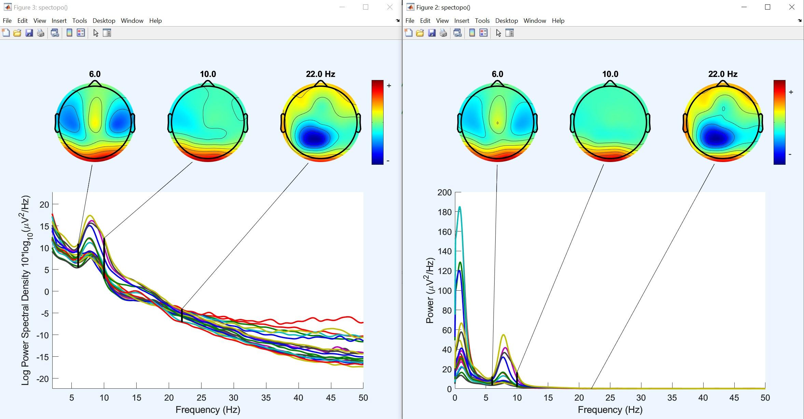

# Linear spectopo()
This is a custom spectopo() function for EEGLAB to use linear scale in power spectral density (PSD) plot. You can plot your PSD in microV^2/Hz 

How to use the function
1. Download the 'spectopo' function from this site.
2. Go to the directory [eeglabroot]/eeglab/functions/sigprocfunc
3. Overwrite the existing 'spectopo' function with the downloaded one.
4. When using 'Plot' -> 'Channel spectra and maps', enter the custom option 'useLinearScale', 'on' as shown below (default: 'off')

Results comparison. Left, convention; Right, the new supported feature.

Other changes I made include
1. The default 'freqfac' is changed 1 -> 10 (i.e. frequency resolution is increased from 1 to 0.1 Hz)
2. The default 'overlap' is changed to 0 -> 50% (i.e. the effect of the default Hamming window is counteracted by the half-window overlap--this is the original definition of Welch's method)

01/29/2024 Makoto Miyakoshi.
