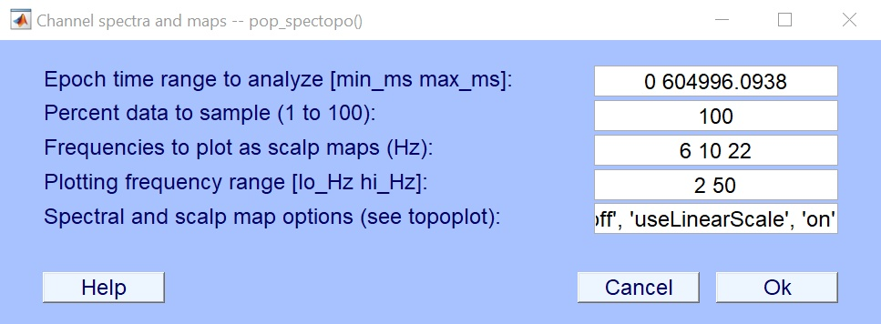

# Linear spectopo()
This is a custom spectopo() function for EEGLAB to use linear scale in power spectral density (PSD) plot. You can plot your PSD in microV^2/Hz 

Use the custom option 'useLinearScale', 'on' as below, you can plot 

obtain microV^2 plot instead of 10*log10.

01/29/2024 Makoto Miyakoshi.
